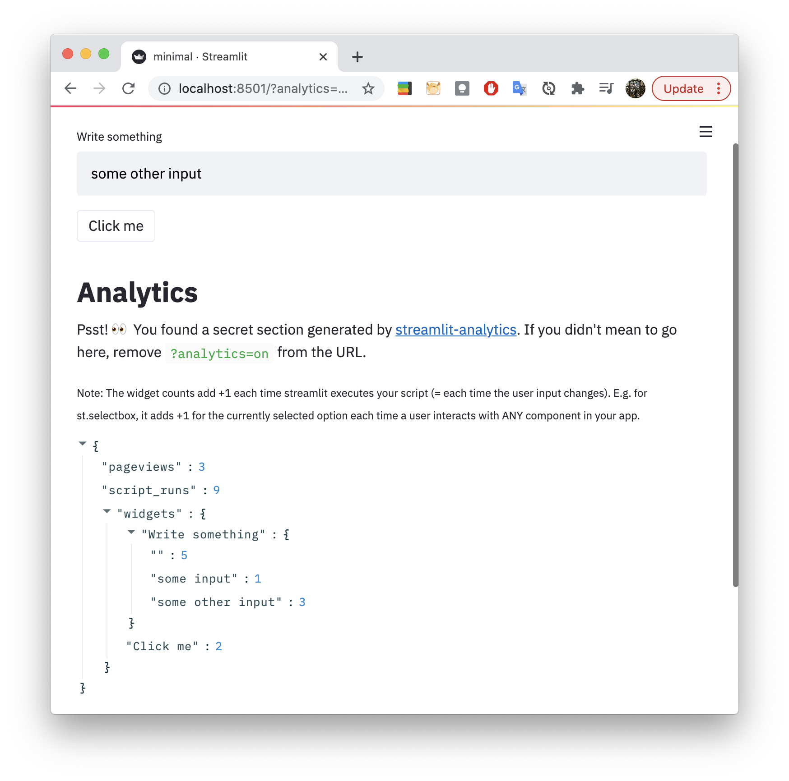

# streamlit-analytics

**👀 Track & visualize user inputs to your streamlit app**

This is a small extension for the fantastic [streamlit](https://www.streamlit.io/) 
framework. With just one line of code, it counts page views, tracks all user inputs 
to your streamlit widgets and visualizes the results directly in your browser. Think 
Google Analytics but for streamlit.

<p align="center">
    
</p>


## Installation

```bash
pip install git+https://github.com/jrieke/streamlit-analytics.git
```

Requires Python 3.6+


## How to use it

```python
import streamlit as st
import streamlit_analytics

with streamlit_analytics.track():
    st.text_input("Write something")
    st.button("Click me")
```

That's it! 🎈 All pageviews and user inputs are now tracked and counted. Of course, 
you can also use [any other streamlit widget](https://docs.streamlit.io/en/stable/api.html#add-widgets-to-sidebar) 
in the `with` block (both from `st.` and `st.sidebar.`). 

<sub>Note: One thing that doesn't work (yet) is tracking widgets created directly from 
containers, expanders, or columns (e.g. `st.beta_expander().button("foo")`). Instead, 
please use a with statement, e.g. `with st.beta_expander(): st.button("foo")`.</sub>

To view the results, open your app like normal and append `?analytics=on` to the URL 
(e.g. http://localhost:8501/?analytics=on). The results are then shown directly below 
your app (see image above).


## More options

- You can **password-protect** your analytics results with 
`streamlit_analytics.track(unsafe_password=...)`. The streamlit app will then ask you 
for this password. Do not choose an important password here – it is sent without 
encryption.
- If you don't want a **huge `with` block**, you can also do:

    ```python
    import streamlit_analytics

    streamlit_analytics.start_tracking()
    # your streamlit code here
    streamlit_analytics.stop_tracking()
    ```

- *Experimental:* You can **store analytics results as a json file** by passing 
`save_to_json="path/to/file.json"` to `streamlit_analytics.track` or 
`streamlit_analytics.stop_tracking`. At the moment, this may lead to problems with 
concurrency if many users access the site at the same time. 


## Next steps

PRs are welcome! If you want to work on any of these things, please open an issue to coordinate. 

- enable tracking for sidebar, beta_container, beta_expander, beta_columns
- do not track inputs at each script execution but only when they change (probably requires storing current inputs in session state or cache and checking at each execution what changed)
- better display of results
- track results (or at least pageviews) per day/hour and show chart